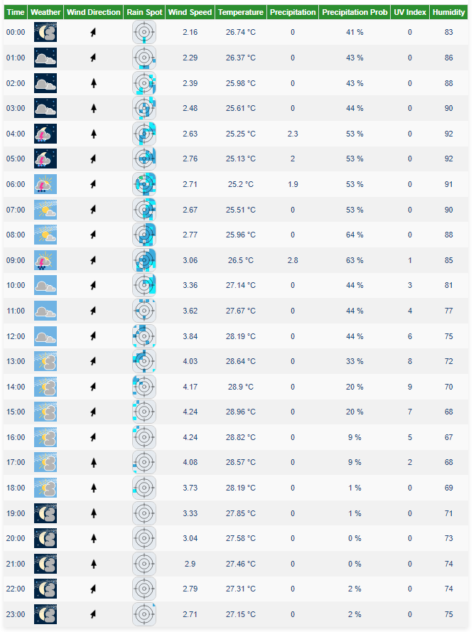

# Weather Forecast Application

This project is a PHP application that retrieves weather forecast data from the [Meteoblue Free Weather API](https://www.meteoblue.com/en/weather-api/index/overview) and renders a custom interface for displaying the weather forecast.

## Features

- Fetches weather data from the Meteoblue Free Weather API.
- Displays real-time weather forecast information.
- Customizable interface to match your design preferences.

## Prerequisites

Before you begin, ensure you have met the following requirements:

- PHP 8.1 or higher installed on your machine.
- Composer installed for managing dependencies.
- An API key from [Meteoblue](https://www.meteoblue.com/en/weather-api/index/overview).

## Getting Started

Follow these steps to get the project up and running on your local machine.

### Installation

1. **Clone the repository:**

    ```sh
    git clone https://github.com/po3nx/mb_weather.git
    cd mb_weather
    composer install
    ```

2. **Set up environment variables:**

    Rename the `.env.example` file to `.env` in the root directory of your project. Add your Meteoblue API key, set APP_ENV to prod for production, and adjust other settings as needed:

    ```plaintext
    APP_ENV=prod
    API_KEY=your_api_key
    DEFAULT_LAT=your_desired_default_lat
    DEFAULT_LON=your_desired_default_lon

    DB_CONNECTION=mysql
    DB_HOST=your_database_host
    DB_PORT=your_database_post
    DB_DATABASE=your_database_db
    DB_USERNAME=your_database_user
    DB_PASSWORD=your_database_password

    ```
    
3. **Database Migration:**

    Run the migration script to create the table in your database:

    ```sh
    php migration.php
    ```


### Usage

1. **Run the application:**

    You can start the PHP built-in web server by running:

    ```sh
    php -S localhost:8000 
    ```
2. **Synchronize the data:**

    Open your web browser and navigate to http://localhost:8000/sync. Wait for the synchronization process to complete. If the process is successful, a success status will be displayed; otherwise, a failure status will be shown.

3. **View the data:**

    Open your web browser and navigate to `http://localhost:8000` to see the weather forecast interface.

## Customization

You can customize the interface by modifying the HTML and CSS files located in the `src/views` directory. Feel free to add your styles and layout preferences to match your design requirements.

## Contributing

Contributions are welcome! Please follow these steps to contribute:

1. Fork the repository.
2. Create a new branch (`git checkout -b feature-branch`).
3. Make your changes.
4. Commit your changes (`git commit -m 'Add new feature'`).
5. Push to the branch (`git push origin feature-branch`).
6. Create a Pull Request.

## Official Documentation
Please read the Meteoblue documentation at https://docs.meteoblue.com/en/weather-apis/introduction/overview

## Sample Output
